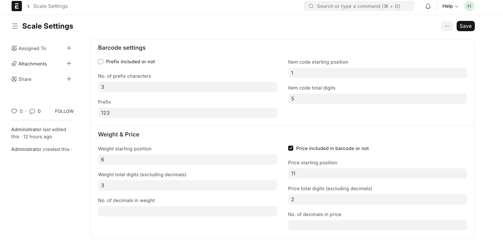
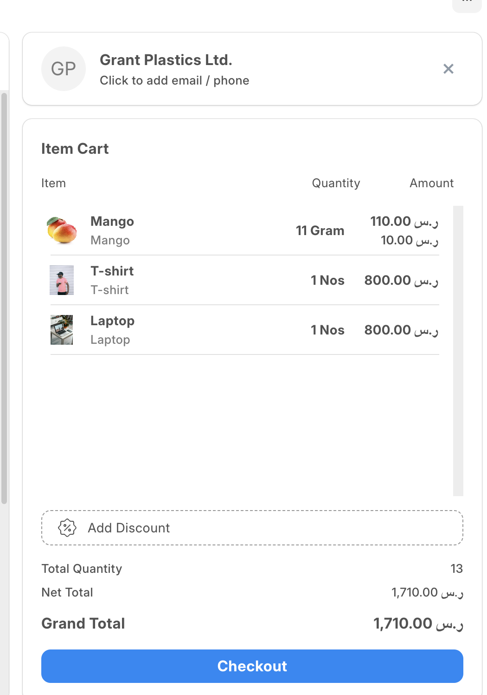

# Scale

This Frappe app, specifically designed for the POS module within ERPNext. Seamlessly integrate weighing machines with ERPNext POS system, supporting any type and brand of weighing scales and adapting effortlessly to various settings. Perfect for businesses in the vegetable, fruit, nut, bakery, and sweet shop sectors, this app enhances your POS system for a smooth and efficient experience.

## Features

- **Barcode Settings Configuration:** Customize prefix inclusion, item code, weight, and price settings in barcodes.
- **Search Functionality:** Efficiently search and retrieve item details using barcodes.
- **Price List Integration:** Automatically fetch price list rates for items.
- **Stock Availability Check:** Get real-time stock availability for items.
- **Error Logging:** Comprehensive error logging for debugging and troubleshooting.

## Installation

1. `bench get-app https://github.com/ERPGulf/scale`
2. `bench --site yoursite.erpgulf.com install-app scale`
3. `bench --site yoursite.erpgulf.com migrate`

## Configuration

### Set up Scale Settings

1. Go to Scale Settings in the ERPNext interface.
2. Configure the barcode settings including prefix, item code, weight, and price settings.

   

## Using the App

- Scan the barcode that printed by weighing machine on POS field as you do with regular item. It will calculate weight and price as per your scale settings.

  

- Make sure that your scale settings follows scale manufacture standard.

## Troubleshooting

- **Error in fetching scale settings:** Ensure that the Scale Settings are properly configured in the ERPNext interface.
- **Error in processing barcode:** Verify the barcode format and ensure it matches the configured settings.

## Contact

Feel free to contact us for bug reporting and feature requests at [support@ERPGulf.com](mailto:support@ERPGulf.com).

Harsha
